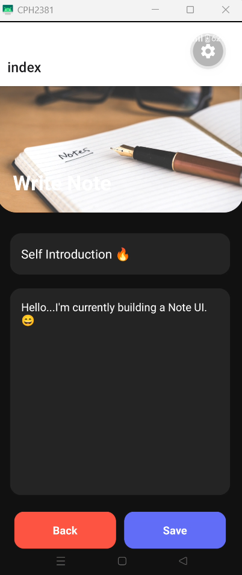

# 📝 Notes App (Expo + React Native)

A simple and responsive **Notes App** built using **React Native** and **Expo Router**.

This application allows users to:

* Create notes
* Search notes instantly
* Toggle between Dark and Light mode
* View notes in responsive card layouts
* Experience smooth keyboard handling and modern UI interactions

---

# 📂 Project Structure

```text
src/
│
├── app/
│   ├── _layout.tsx
│   └── index.tsx
│
├── components/
│   ├── NoteCard.js
│   └── ThemeToggle.js
│
├── data/
│   └── notes.js
│
├── screens/
│   ├── NotesListScreen.js
│   └── NoteEditorScreen.js
│
├── styles/
│   └── colors.js
```

---

# 📸 App Preview

## Note Editor Screen

<p align="center">
  
</p>

---

## Notes List (Dark Theme)

<p align="center">
  
</p>

---

## Notes List (Light Theme)

<p align="center">
  
</p>

---

# 🚀 App Flow

```text
index.tsx
   ↓
NotesListScreen
   ↓
ThemeToggle
   ↓
FlatList
   ↓
NoteCard
```

The app starts from `index.tsx`, which loads the `NotesListScreen` as the main screen.

---

# ⚙️ Core Components

## 1. index.tsx

**Path:** `src/app/index.tsx`

Acts as the entry point for Expo Router and loads the Notes List screen.

```tsx
import NotesListScreen from "../screens/NotesListScreen";

export default function HomeScreen() {
  return <NotesListScreen />;
}
```

---

## 2. colors.js

**Path:** `src/styles/colors.js`

Centralized theme management.

```js
export const lightTheme = { ... };
export const darkTheme = { ... };
```

### Benefits

✅ Cleaner styling
✅ Reusable colors
✅ Easy Dark/Light theme support

---

## 3. ThemeToggle.js

**Path:** `src/components/ThemeToggle.js`

Handles switching between Dark and Light mode.

### Props

```js
{
  darkMode,
  setDarkMode,
  theme
}
```

### Toggle Flow

```text
Switch
   ↓
onValueChange
   ↓
setDarkMode()
   ↓
UI Re-render
```

Example:

```js
<Switch
  value={darkMode}
  onValueChange={setDarkMode}
/>
```

---

## 4. NoteCard.js

**Path:** `src/components/NoteCard.js`

Displays individual notes.

### Props

```js
{
  note,
  theme
}
```

### Structure

```text
Pressable
 ├── Title
 ├── Content
 └── Date
```

### Features

### Pressable

Makes each note card clickable.

```js
<Pressable>
```

### Text Limiting

Prevents overflow:

```js
numberOfLines={2}
```

### Dynamic Styling

Uses `StyleSheet.compose()` to combine static and dynamic styles.

```js
StyleSheet.compose(styles.card, {
  backgroundColor: theme.card,
});
```

---

## 5. NotesListScreen.js

**Path:** `src/screens/NotesListScreen.js`

Main screen of the app.

### Responsibilities

* Notes state management
* Search functionality
* Add new notes
* Theme handling
* Rendering notes with FlatList

---

# 🪝 React Hooks Used

## useState()

Stores dynamic app data.

```js
const [notes, setNotes] = useState([]);
```

---

## useColorScheme()

Detects system theme automatically.

```js
const scheme = useColorScheme();
```

Example:

```text
Dark mode enabled
      ↓
scheme === 'dark'
```

---

## useWindowDimensions()

Creates responsive layouts.

```js
const { width } = useWindowDimensions();
```

Example:

```js
paddingHorizontal: width > 768 ? 40 : 20;
```

---

# 🎨 Theme Handling

Theme updates dynamically:

```js
const theme =
  darkMode
    ? darkTheme
    : lightTheme;
```

Flow:

```text
System Theme
     ↓
darkMode state
     ↓
Theme object selected
     ↓
UI updates
```

---

# ➕ Add Note Workflow

User enters:

* Title
* Content

Then:

```text
Add Button
    ↓
addNote()
    ↓
New note object
    ↓
setNotes()
    ↓
FlatList refresh
```

### Validation

Prevents empty notes.

```js
if (!title || !content) return;
```

### New Note Object

```js
const newNote = {
  id: Date.now().toString(),
  title,
  content,
  date: new Date().toDateString(),
};
```

---

# 🔍 Search Functionality

Search updates in real-time.

Flow:

```text
User types
    ↓
Search state updates
    ↓
Notes filtered
    ↓
FlatList updates
```

Filtering:

```js
notes.filter(...)
```

---

# 📋 FlatList Rendering

Efficient rendering of notes.

```js
<FlatList
  data={filteredNotes}
  renderItem={({ item }) => (
    <NoteCard />
  )}
/>
```

Flow:

```text
Notes Array
    ↓
FlatList
    ↓
renderItem()
    ↓
NoteCard
```

---

# ✍️ NoteEditorScreen.js

**Path:** `src/screens/NoteEditorScreen.js`

Dedicated editor screen.

## KeyboardAvoidingView

Ensures inputs remain visible when keyboard opens.

```js
<KeyboardAvoidingView>
```

Flow:

```text
Keyboard opens
     ↓
Screen shifts
     ↓
Inputs stay visible
```

---

## ImageBackground

Used for decorative header design.

```js
<ImageBackground>
```

---

## Responsive Design

Uses:

```js
useWindowDimensions()
```

to adapt UI for phones and tablets.

---

# 🏗️ Architecture

```text
index.tsx
   ↓
NotesListScreen
   ├── ThemeToggle
   ├── TextInput
   ├── Add Button
   └── FlatList
          ↓
       NoteCard
```

Component-based structure improves:

* Reusability
* Maintainability
* Scalability
* Code readability

---

# ✅ Assignment Requirements Checklist

| Requirement           | Status |
| --------------------- | ------ |
| FlatList              | ✅      |
| TextInput             | ✅      |
| Pressable             | ✅      |
| Switch                | ✅      |
| KeyboardAvoidingView  | ✅      |
| ImageBackground       | ✅      |
| useColorScheme()      | ✅      |
| useWindowDimensions() | ✅      |
| StyleSheet.create()   | ✅      |
| StyleSheet.compose()  | ✅      |
| Responsive UI         | ✅      |
| Dark/Light Theme      | ✅      |

---

# 🛠️ Installation

Clone the repository:

```bash
git clone <repository-url>
```

Install dependencies:

```bash
npm install
```

Run the project:

```bash
npx expo start
```

---

# 👨‍💻 Author

**Prince Kumar**

---

# 📄 License

This project is created for **educational purposes**.
